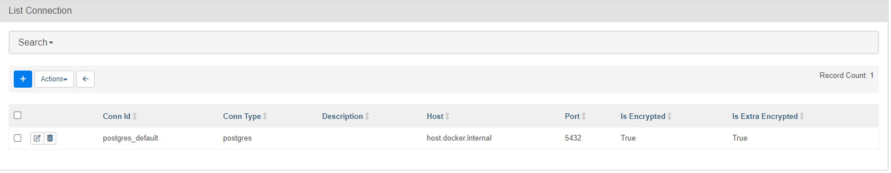
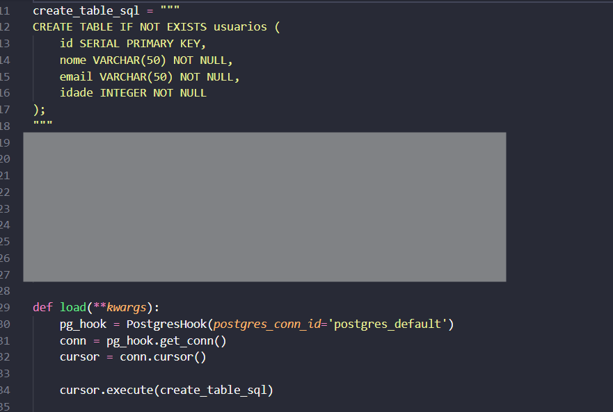
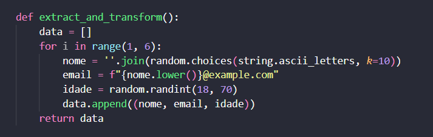
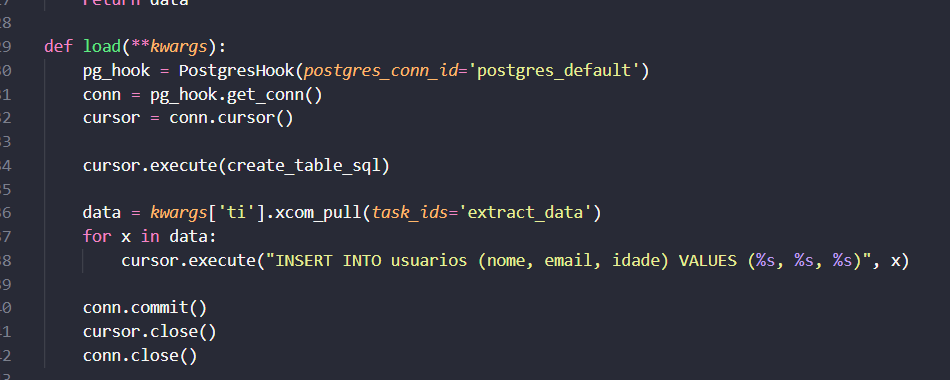
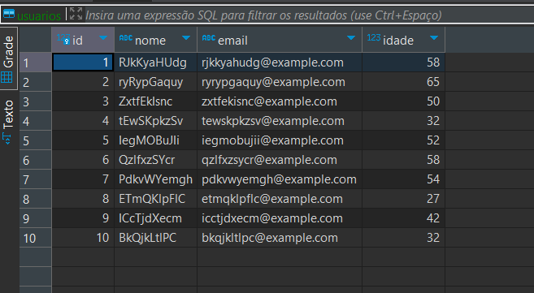
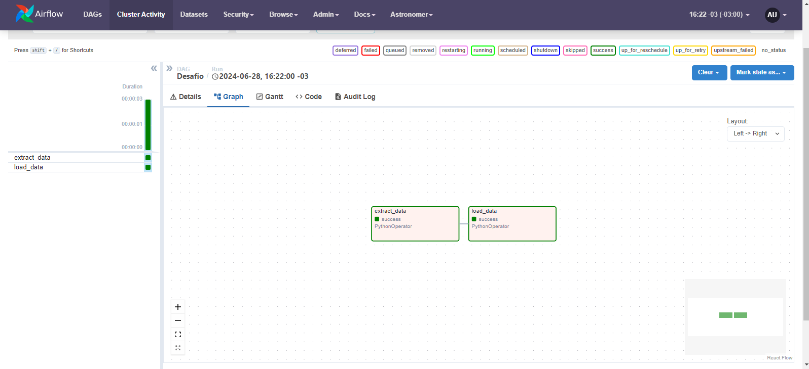

# Curso DataWayBR

Este repositório contém os materiais e projetos desenvolvidos por mim durante o curso da DataWayBR. O curso abordou conceitos básicos do Airflow. Abaixo está a descrição do desafio proposto no curso.

# Desafio Final: Configuração de Pipeline com Apache Airflow

Você foi designado para criar um pipeline no Apache Airflow para manipular dados usando um banco de dados PostgreSQL. 

O objetivo é criar uma sequência de tarefas que criem tabelas em um banco de dados, insiram dados nessas tabelas e gerem informações aleatórias através de um operador Python.

Tarefas a serem realizadas:

1. Configuração Inicial:

    * Configure as credenciais do PostgreSQL no Airflow. 
    * Crie uma conexão com o banco de dados.

## Resolução:

2. Criar Tabelas no PostgreSQL:

    * Utilize o operador PostgreSQL do Airflow para criar uma tabela no banco de dados.
    * Crie uma tabela de usuarios
    * A tabela usuarios deve ter campos como id, nome, email e idade.

## Resolução:
### Optei por utilizar o postgres hook para criar a tabela e inserir os dados, como esta descrito no módulo [Extra](https://github.com/Saldanhaa7/DataWayBR-Airflow?tab=readme-ov-file#Extra)

Código da execução:

3. Gerar Dados com Python:

    * Crie um operador Python que gere os dados.

## Resolução:

4. Inserir Dados nas Tabelas:

    * Use o operador PostgreSQL para inserir dados nas tabelas usuarios e compras
    * Insira pelo menos 5 registros na tabela usuarios

## Resolução:

Boa sorte!

## Extra

Pesquise sobre como utilizar o postgres hook no airflow e tente inserir os dados utilizando o hook ao invés do operador.